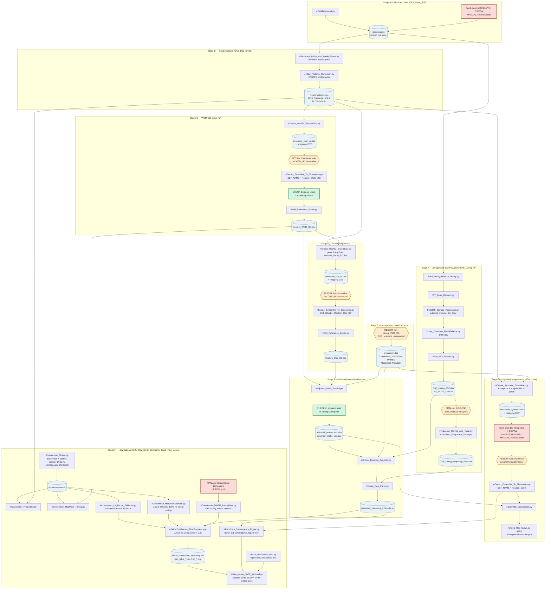

# RUN ORDER — scripts and ResSim simulations

The order the whole Cowlitz chain has to be re-run in, so nothing is skipped.
Read with `COWLITZ_INDEX.md` (context) and `CLAUDE.md` (DSS conventions).

Rules that apply throughout:

- **CAS_Unreg_FF runs first.** It owns `data/obsData.dss` and the download
  script. Everything else reads from it.
- **ResSim steps are manual.** No script launches ResSim. Where a box says
  RESSIM, stop, run the alternative in the watershed, and confirm the run
  finished before continuing.
- **Ensemble DSS files are built into `CAS_Reg_Unreg/output/`, not into the
  watershed.** Loading them into ResSim is a manual step.
- **Pairing a simulation with the wrong mapping CSV produces a
  plausible-looking, completely wrong series.** `SET_NAME` in
  `#Extract_Ensemble_To_Timeseries.py` sets both together — change that one
  variable, never the two paths separately.
- Three scripts WRITE into the shared `obsData.dss`
  (`#Reservoir_Inflow_And_Basin_Peaks.py`, `#Inflow_Volume_Correction.py`,
  `#DataDownload.py`). Do not run them casually.

---

## Flow chart

---

## Step table

| # | Step | Project | Reads | Writes | Do not skip because |
|---|---|---|---|---|---|
| 0a | Hand-clean MOS hourly ELEV in DSSVue | CAS_Unreg_FF | — | `//MOS/ELEV//1HOUR/CWMS-CLEAN/` | Manual and irreproducible. Never regenerate. |
| 0b | `#DataDownload.py` | CAS_Unreg_FF | NWIS / CWMS | `obsData.dss` | Everything downstream reads this file. |
| 1 | `Build_Hourly_Holdout_Unreg.py` | CAS_Unreg_FF | `obsData.dss` | `MOS_Cleaned.dss` | Holdout is the basis of the unreg record. |
| 2 | `WY_Peak_Records.py` | CAS_Unreg_FF | `MOS_Cleaned.dss` | `wy_peak_records.csv` | Supplies the regression fit set. |
| 3 | `PeakDiff_Storage_Regression.py` | CAS_Unreg_FF | `wy_peak_records.csv` | `peakdiff_storage_regressions.csv` | Fills the gap years. Re-fit if any peak changed. |
| 4 | `Unreg_Durations_MassBalance.py` | CAS_Unreg_FF | `obsData.dss` | `unreg_durations_massbalance.csv` | 3/5-day come from here, not from the hourly. |
| 5 | `Write_SSP_Record.py` | CAS_Unreg_FF | steps 2–4 | `CAS_Unreg_SSP.dss`, `wy_record_ssp.csv` | Final assembly + monotonicity enforcement. |
| 6 | **HEC-SSP** 2026_Restudy analyses | CAS_Unreg_FF | `CAS_Unreg_SSP.dss` | `Bulletin17Results/*.rpt` | WY1969–1973 censored; no Grubbs-Beck. |
| 7 | `Frequency_Curves_And_Table.py` | CAS_Unreg_FF | `.rpt` files | `CAS_Unreg_frequency_table.csv` | The AEP source for the regulated curve. |
| 8 | `#Reservoir_Inflow_And_Basin_Peaks.py` | CAS_Reg_Unreg | `obsData.dss` | `obsData.dss` | Writes to the shared store. |
| 9 | `#Inflow_Volume_Correction.py` | CAS_Reg_Unreg | `obsData.dss` | `obsData.dss`, `ResSimInflows.dss` | Ensembles are built from the VOLCOR record. |
| 10 | `#Create_wcmRC_Ensembles.py` | CAS_Reg_Unreg | `ResSimInflows.dss` | `ensemble_wcm_rc.dss` + mapping | Mapping CSV is how output gets re-dated. |
| 11 | **ResSim** WCM_RC alternative | — | ensemble | `rss\WCM_RC\simulation.dss` | Manual. |
| 12 | `#Extract_Ensemble_To_Timeseries.py` `SET_NAME="ResSim_WCM_RC"` | CAS_Reg_Unreg | `simulation.dss` + mapping | `ResSim_WCM_RC.dss` | **CHECK 1 runs here.** |
| 13 | `#Add_Reference_Series.py` | CAS_Reg_Unreg | `obsData.dss` | `ResSim_WCM_RC.dss` | Adds rule curve for plotting. |
| 14 | `#Create_ObsRC_Ensembles.py` | CAS_Reg_Unreg | `ResSimInflows.dss`, `ResSim_WCM_RC.dss` | `ensemble_obs_rc.dss` + mapping | Windows are centred on WCM_RC peaks — must follow step 12. |
| 15 | **ResSim** OBS_RC alternative | — | ensemble | `rss\OBS_RC\simulation.dss` | Manual. |
| 16 | `#Extract_Ensemble_To_Timeseries.py` `SET_NAME="ResSim_Obs_RC"` | CAS_Reg_Unreg | `simulation.dss` + mapping | `ResSim_Obs_RC.dss` | Check 1 runs here too. |
| 17 | `#Add_Reference_Series.py` | CAS_Reg_Unreg | `obsData.dss` | `ResSim_Obs_RC.dss` | Adds rule curve + observed pool. |
| 18 | **ResSim** Unreg_POR_FIS | — | `ResSimInflows.dss` | `rss\Unreg_POR_FIS\simulation.dss` | Manual. Needed by steps 19, 20 and 22. |
| 19 | `#Adjusted_Peak_Record.py` | CAS_Reg_Unreg | both result DSS, USGS peaks, unreg POR | `adjusted_peaks.csv/.dss`, `adjusted_peaks_screened_out.csv` | **CHECK 2 runs here**, and it screens. Step 20 refuses a CSV without `screen_code`. |
| 20 | `#Critical_Duration_Adjusted.py` | CAS_Reg_Unreg | `adjusted_peaks.csv`, unreg POR | `critical_duration_adjusted_fits.csv` | Peak and 1-day tied; peak-to-peak adopted. |
| 21 | `#Unreg_Reg_Curve.py` | CAS_Reg_Unreg | step 20 + `CAS_Unreg_frequency_table.csv` + `ResSim_WCM_RC_reg_vs_unreg_wy.csv` | `regulated_frequency_inferred.csv` | Regulated AEP is inherited, not fitted. LOESS centre-of-mass line, not a straight power law. Compares against the 2009 curve. |
| 22 | `#Create_Synthetic_Ensembles.py` | CAS_Reg_Unreg | `ResSimInflows.dss`, unreg POR elev | `ensemble_synthetic.dss` + mapping | Populates above the 100-year. |
| 22b | **Hand-chop the mini peaks in DSSVue** (Dec1977, Nov1986) | CAS_Reg_Unreg | `ensemble_synthetic.dss` | `ensemble_synthetic.dss` | Manual and irreproducible. **Step 22 deletes and rewrites this file, so re-running it destroys the chop.** See "The hand-chopped synthetics" below. |
| 23 | **ResSim** synthetic alternative | — | ensemble | `simulation.dss` | Manual. Copy result to `output/simulation.dss`. |
| 24 | `#Extract_Ensemble_To_Timeseries.py` `SET_NAME="ResSim_Synth"` | CAS_Reg_Unreg | `simulation.dss` + mapping | `ResSim_Synth.dss` | Synthetic years are 1801+; round-trip check is off. |
| 25 | `#Synthetic_Diagnostics.py` | CAS_Reg_Unreg | `ResSim_Synth.dss`, step 20 | `synthetic_results.csv` | Verify scaled peaks hit their targets. |
| 26 | `#Unreg_Reg_Curve.py` again | CAS_Reg_Unreg | + synthetics | updated curve | Upper end is unconstrained without them. |
| 27 | `#Coweeman_Timing.py` | CAS_Reg_Unreg | NWIS, WA Ecology | `data/coweeman/*` | Caches Ecology 26C075 and the USGS peak records. Needs network; everything in Stage H reads the cache afterwards. |
| 28 | `#Coweeman_Proportion.py`, `#Coweeman_RegPeak_Timing.py`, `#Coweeman_LagFactor_Evidence.py`, `#Coweeman_HistoricPeakRatio.py` | CAS_Reg_Unreg | cache + `ResSim_WCM_RC.dss` | diagnostics CSV/PNG | Evidence for the two Section 8 constants. None of them writes a result the curve reads — they are what justifies the numbers typed into step 30. |
| 29 | `#Coweeman_PRISM_PrecipRatio.py` | CAS_Reg_Unreg | StreamStats polygons + PRISM grids | `prism_basin_precip_ratio.csv/.png` | Tests the equal-depth assumption the drainage-area ratio rests on. Runs locally only. |
| 30 | `#BelowConfluence_FlowFrequency.py` | CAS_Reg_Unreg | `regulated_frequency_inferred.csv` | `below_confluence_frequency.csv`, `freq_table_*.csv`, `freq_*.png` | **The Section 8 deliverable.** Four locations, gage to the Coweeman confluence. Drainage areas and the 0.80 lag factor are constants at the top. |
| 31 | `#Transform_Convergence_Figure.py` | CAS_Reg_Unreg | `regulated_frequency_inferred.csv`, event pairs | `transform_convergence.png` | Figure only. The convergence point is drawn, not fitted, and feeds nothing. |
| 32 | `make_confluence_map.py` | CAS_Unreg_FF/docs/figures | NLDI / NWIS | `confluence_map.png` | Figure only. Own conda env (`environment.yml`); separate cache from `make_basin_map.py`. |
| 33 | `make_memo_draft2_section8.py` | CAS_Reg_Unreg/docs | edited `..._DRAFT.docx`, step 30 | `..._DRAFT2.docx` | Copies the hand-edited draft and inserts Section 8 + Appendix F. **Never regenerates** — see the note below. |

Side branches, not in the main chain: `MOS_STOR_RECORD_COUNT.py`,
`2009_Compare.py`, `PeakRegressionUncertainty.py` (CAS_Unreg_FF QC);
`#MOS_CDB_INFLOW.py`, `#MOS_Special_Release_MinFloodPool.py`,
`Critical_Duration_Correlation.py` (superseded by
`#Critical_Duration_Adjusted.py`), `#Create_Ensembles.py` +
`#ExtractResSimEnsembleResults.py` (the older Unreg_2009_2025 path);
`#Coweeman_Event_Plotly.py` (interactive event viewer, HTML only).

**Superseded coincident-frequency scripts**, kept for the record because they
are the alternatives Section 8 was compared against, not because anything
runs them: `#Coweeman_FlowFrequency.py` (a Coweeman curve of its own),
`#Coincident_PerfectCorrelation.py`, `#Coincident_CorrConditioned.py`,
`#Coincident_TieredScaling.py`, `#EFLewis_Analog_Check.py`. All of them
assume the tributary is at its own AEP when the Cowlitz is at its AEP. The
adopted method does not, so none of them feeds the deliverable.

---

## Checkpoints

Stop and resolve these before continuing; both write CSVs so the decision is
auditable, and neither changes a value.

**CHECK 1 — `#Extract_Ensemble_To_Timeseries.py`.** Regulated vs unregulated at
Castle Rock, hour by hour and water year by water year. The reservoir cannot
make a flood bigger, so a regulated peak above the unregulated peak at a real
event means the two records do not belong together. Outputs
`diagnostics/<SET>_reg_vs_unreg_wy.csv` and
`diagnostics/<SET>_reg_gt_unreg_episodes.csv`. Exceedances where the
unregulated flow is under `REG_UNREG_LOW_FLOW_CFS` are counted separately —
minimum releases and refill drawdown legitimately put more water in the river
than nature would. Same script also runs the round-trip check on the
pass-through records; a systematic offset there means the timing mapping is
wrong.

**CHECK 2 — `#Adjusted_Peak_Record.py`.** Each adjusted peak against the
unregulated peak for the same event, from the Unreg_POR_FIS run. Falls back to
the adopted annual record in `CAS_Unreg_FF/output/wy_record_ssp.csv` when the
POR run is not reachable, and records which source each year used. Reported in
`adjusted_peaks.csv` (`unreg_ref`, `adj_over_unreg`, `unreg_check`) and drawn
on `adjusted_peaks.png` as the unregulated ceiling. A hard failure is an
adjusted peak above the unregulated peak at a flood; look at the unregulated
record first, then the ResSim runs, then the adjustment itself.

This check is also a SCREEN. A year whose adjusted peak exceeds the
unregulated peak AND is at or above `REG_OVER_UNREG_THRESHOLD_CFS` (default
60,000, a user setting) is screened out, because a reservoir cannot raise a
flood. Below the threshold the crossing is expected — minimum release, refill
drawdown — and the year is kept. At 60,000 cfs this catches WY1974 and WY2013;
WY1980 is already out on the event screen.

`screen_passed` is the AND of the same-event screens and this one, and it is
what keeps a year out of everything downstream: `#Critical_Duration_Adjusted.py`
filters on it, and `#Unreg_Reg_Curve.py` re-reads `adjusted_peaks.csv` and drops
anything not eligible, so a stale dataset CSV cannot put a screened year back on
the scatter or the frequency plot. Every omission is listed with its reason in
`adjusted_peaks_screened_out.csv`; the SSP CSV and the DSS record carry eligible
years only.

---

## The memo copy that must not be regenerated (step 33)

`make_memo_draft2_section8.py` COPIES `MEMO_CAS_Combined_FlowFrequency_DRAFT.docx`
and edits the copy. It does not run the generator.

That distinction cost 34 paragraphs once. The first attempt copied
`make_memo_combined.py` and re-ran it, which rebuilds the document from source
and therefore discarded every hand edit made to the `.docx` since it was last
generated — a rewritten Purpose and substantial edits through Sections 2 and 4.

Two consequences:

- **Prose edits belong in `..._DRAFT.docx`**, the hand-edited draft. It is the
  source of truth for everything outside Section 8.
- **`..._DRAFT2.docx` is recreated on every run**, so anything hand-edited
  there is lost. Once DRAFT2 is under review, stop running the script.

`make_memo_combined.py` still exists and still regenerates DRAFT from source.
Do not run it against a draft that has been edited.

---

## The hand-chopped synthetics (step 22b)

`#Create_Synthetic_Ensembles.py` scales an observed event up to a target peak
AND a target 5-day volume. For a sharp source event that combination forces the
shoulders to stretch harder than the peak itself (`f_out` above `f_peak` in the
mapping CSV — 1.9x vs 1.1x for Dec1977). A small rise the observed hydrograph
already had is then lifted in proportion, and comes out looking like a separate
flood a day or two ahead of the main peak. Two members were bad enough to be
misleading:

| Source event | Where | Height as built, at the 500-yr target |
|---|---|---|
| Dec1977 | ~1 day before the peak | 98,100 cfs, 0.43 of the peak |
| Nov1986 | ~2 days before the peak | 103,600 cfs, 0.45 of the peak |

Both were **chopped by hand in DSSVue** in `ensemble_synthetic.dss`, on the
`MOSSYROCK/FLOW-IN` and `CASTLE ROCK/FLOW-LOCAL` records of the affected
members, before the ensemble was loaded into ResSim.

A scripted fix was tried first and rejected: damping the flow-based multiplier
enough to matter also lets a point near the peak scale past the peak, which
invents a new maximum and breaks the peak target. The safe amount of damping
moved the bump by 1-2%, which was not worth the complexity. The hand chop is
the adopted fix.

**The trap.** Step 22 deletes `ensemble_synthetic.dss` before writing it (it
does not append), so re-running it wipes the chop with no warning and the next
ResSim run silently goes back to the two-peaked hydrographs. There is no check
that catches this downstream — the members still hit their peak and volume
targets either way. If step 22 is re-run for any reason, redo 22b.

**What the chop actually changed.** It lowered the regulated peak on four
members, by holding the pool lower going into the main peak — the bump was
filling storage before the flood arrived:

| Member | Regulated peak, pre-chop | post-chop | change |
|---|---|---|---|
| 18 Dec1977 250-yr | 166,082 | 163,780 | −1.4% |
| 19 Dec1977 500-yr | 207,044 | 200,334 | −3.2% |
| 20 Dec1977 beyond | 264,866 | 251,724 | −5.0% |
| 48 Nov1986 beyond | 207,830 | 196,614 | −5.4% |

The other 44 members are unchanged. Dec1977's attenuation ratio tops out at
0.95 rather than 0.99, and Nov1986's at 0.72 rather than 0.76, so the chop
pulls the top of the regulated curve down slightly.

**PROVENANCE GAP — the results in this repository cannot be reproduced from
the ensemble in this repository.** As of commit `db5e090`, `ResSim_Synth.dss`
and `synthetic_results.csv` are **post-chop**, but `ensemble_synthetic.dss` is
still the **unchopped script output** — the chopped ensemble was never uploaded
and exists only on the user's machine. Re-running steps 23-24 from the repo copy
would silently reproduce the pre-chop answer.

The chop lives only in the DSS, so the way to tell them apart is to look at the
hydrograph. Nov1986 500-yr (member 47, synthetic WY1847) is the clearest test:

| File | Pre-peak bump | As a fraction of the peak |
|---|---|---|
| `ensemble_synthetic.dss` (unchopped build) | 103,600 cfs | 0.45 |
| `ResSim_Synth.dss` pre-chop routing | 105,586 cfs | 0.46 |
| `ResSim_Synth.dss` post-chop routing (current) | 97,746 cfs | 0.43 |

Uploading the chopped `ensemble_synthetic.dss` would close the gap. Until then,
treat the ensemble file as an input that no longer matches the results beside
it.

---

## Partial re-runs

| Changed | Re-run from |
|---|---|
| Cleaned MOS elevation | step 1 (the whole chain) |
| USGS record extended / WY close-out | step 1, then step 19 |
| ResSim operation set or rules | step 11 (both runs, then stage F) |
| Rule curve anchors | steps 10 and 13 (anchors are duplicated in three scripts) |
| Synthetic targets or shapes | step 22 — **then redo the hand-chop at 22b**, which step 22 has just overwritten |
| SSP analysis settings | step 6, then step 21 |
| Regulated curve (step 21 or 26 re-run) | step 30, then 31 and 33 — Section 8 is built on `regulated_frequency_inferred.csv` |
| Drainage areas or the 0.80 lag factor | step 30, then 33 (constants at the top of `#BelowConfluence_FlowFrequency.py`) |
| Prose anywhere outside Section 8 | edit `..._DRAFT.docx`, then re-run step 33 |
