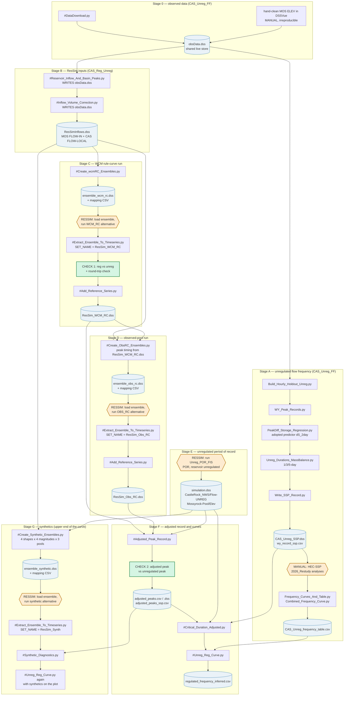

# RUN ORDER — scripts and ResSim simulations

The order the whole Cowlitz chain has to be re-run in, so nothing is skipped.
Read with `COWLITZ_INDEX.md` (context) and `CLAUDE.md` (DSS conventions).

Rules that apply throughout:

- **CAS_Unreg_FF runs first.** It owns `data/obsData.dss` and the download
  script. Everything else reads from it.
- **ResSim steps are manual.** No script launches ResSim. Where a box says
  RESSIM, stop, run the alternative in the watershed, and confirm the run
  finished before continuing.
- **Ensemble DSS files are built into `CAS_Reg_Unreg/output/`, not into the
  watershed.** Loading them into ResSim is a manual step.
- **Pairing a simulation with the wrong mapping CSV produces a
  plausible-looking, completely wrong series.** `SET_NAME` in
  `#Extract_Ensemble_To_Timeseries.py` sets both together — change that one
  variable, never the two paths separately.
- Three scripts WRITE into the shared `obsData.dss`
  (`#Reservoir_Inflow_And_Basin_Peaks.py`, `#Inflow_Volume_Correction.py`,
  `#DataDownload.py`). Do not run them casually.

---

## Flow chart

---

## Step table

| # | Step | Project | Reads | Writes | Do not skip because |
|---|---|---|---|---|---|
| 0a | Hand-clean MOS hourly ELEV in DSSVue | CAS_Unreg_FF | — | `//MOS/ELEV//1HOUR/CWMS-CLEAN/` | Manual and irreproducible. Never regenerate. |
| 0b | `#DataDownload.py` | CAS_Unreg_FF | NWIS / CWMS | `obsData.dss` | Everything downstream reads this file. |
| 1 | `Build_Hourly_Holdout_Unreg.py` | CAS_Unreg_FF | `obsData.dss` | `MOS_Cleaned.dss` | Holdout is the basis of the unreg record. |
| 2 | `WY_Peak_Records.py` | CAS_Unreg_FF | `MOS_Cleaned.dss` | `wy_peak_records.csv` | Supplies the regression fit set. |
| 3 | `PeakDiff_Storage_Regression.py` | CAS_Unreg_FF | `wy_peak_records.csv` | `peakdiff_storage_regressions.csv` | Fills the gap years. Re-fit if any peak changed. |
| 4 | `Unreg_Durations_MassBalance.py` | CAS_Unreg_FF | `obsData.dss` | `unreg_durations_massbalance.csv` | 3/5-day come from here, not from the hourly. |
| 5 | `Write_SSP_Record.py` | CAS_Unreg_FF | steps 2–4 | `CAS_Unreg_SSP.dss`, `wy_record_ssp.csv` | Final assembly + monotonicity enforcement. |
| 6 | **HEC-SSP** 2026_Restudy analyses | CAS_Unreg_FF | `CAS_Unreg_SSP.dss` | `Bulletin17Results/*.rpt` | WY1969–1973 censored; no Grubbs-Beck. |
| 7 | `Frequency_Curves_And_Table.py` | CAS_Unreg_FF | `.rpt` files | `CAS_Unreg_frequency_table.csv` | The AEP source for the regulated curve. |
| 8 | `#Reservoir_Inflow_And_Basin_Peaks.py` | CAS_Reg_Unreg | `obsData.dss` | `obsData.dss` | Writes to the shared store. |
| 9 | `#Inflow_Volume_Correction.py` | CAS_Reg_Unreg | `obsData.dss` | `obsData.dss`, `ResSimInflows.dss` | Ensembles are built from the VOLCOR record. |
| 10 | `#Create_wcmRC_Ensembles.py` | CAS_Reg_Unreg | `ResSimInflows.dss` | `ensemble_wcm_rc.dss` + mapping | Mapping CSV is how output gets re-dated. |
| 11 | **ResSim** WCM_RC alternative | — | ensemble | `rss\WCM_RC\simulation.dss` | Manual. |
| 12 | `#Extract_Ensemble_To_Timeseries.py` `SET_NAME="ResSim_WCM_RC"` | CAS_Reg_Unreg | `simulation.dss` + mapping | `ResSim_WCM_RC.dss` | **CHECK 1 runs here.** |
| 13 | `#Add_Reference_Series.py` | CAS_Reg_Unreg | `obsData.dss` | `ResSim_WCM_RC.dss` | Adds rule curve for plotting. |
| 14 | `#Create_ObsRC_Ensembles.py` | CAS_Reg_Unreg | `ResSimInflows.dss`, `ResSim_WCM_RC.dss` | `ensemble_obs_rc.dss` + mapping | Windows are centred on WCM_RC peaks — must follow step 12. |
| 15 | **ResSim** OBS_RC alternative | — | ensemble | `rss\OBS_RC\simulation.dss` | Manual. |
| 16 | `#Extract_Ensemble_To_Timeseries.py` `SET_NAME="ResSim_Obs_RC"` | CAS_Reg_Unreg | `simulation.dss` + mapping | `ResSim_Obs_RC.dss` | Check 1 runs here too. |
| 17 | `#Add_Reference_Series.py` | CAS_Reg_Unreg | `obsData.dss` | `ResSim_Obs_RC.dss` | Adds rule curve + observed pool. |
| 18 | **ResSim** Unreg_POR_FIS | — | `ResSimInflows.dss` | `rss\Unreg_POR_FIS\simulation.dss` | Manual. Needed by steps 19, 20 and 22. |
| 19 | `#Adjusted_Peak_Record.py` | CAS_Reg_Unreg | both result DSS, USGS peaks, unreg POR | `adjusted_peaks.csv/.dss`, `adjusted_peaks_screened_out.csv` | **CHECK 2 runs here**, and it screens. Step 20 refuses a CSV without `screen_code`. |
| 20 | `#Critical_Duration_Adjusted.py` | CAS_Reg_Unreg | `adjusted_peaks.csv`, unreg POR | `critical_duration_adjusted_fits.csv` | Peak and 1-day tied; peak-to-peak adopted. |
| 21 | `#Unreg_Reg_Curve.py` | CAS_Reg_Unreg | step 20 + `CAS_Unreg_frequency_table.csv` + `ResSim_WCM_RC_reg_vs_unreg_wy.csv` | `regulated_frequency_inferred.csv` | Regulated AEP is inherited, not fitted. LOESS centre-of-mass line, not a straight power law. Compares against the 2009 curve. |
| 22 | `#Create_Synthetic_Ensembles.py` | CAS_Reg_Unreg | `ResSimInflows.dss`, unreg POR elev | `ensemble_synthetic.dss` + mapping | Populates above the 100-year. |
| 23 | **ResSim** synthetic alternative | — | ensemble | `simulation.dss` | Manual. Copy result to `output/simulation.dss`. |
| 24 | `#Extract_Ensemble_To_Timeseries.py` `SET_NAME="ResSim_Synth"` | CAS_Reg_Unreg | `simulation.dss` + mapping | `ResSim_Synth.dss` | Synthetic years are 1801+; round-trip check is off. |
| 25 | `#Synthetic_Diagnostics.py` | CAS_Reg_Unreg | `ResSim_Synth.dss`, step 20 | `synthetic_results.csv` | Verify scaled peaks hit their targets. |
| 26 | `#Unreg_Reg_Curve.py` again | CAS_Reg_Unreg | + synthetics | updated curve | Upper end is unconstrained without them. |

Side branches, not in the main chain: `MOS_STOR_RECORD_COUNT.py`,
`2009_Compare.py`, `PeakRegressionUncertainty.py` (CAS_Unreg_FF QC);
`#MOS_CDB_INFLOW.py`, `#MOS_Special_Release_MinFloodPool.py`,
`Critical_Duration_Correlation.py` (superseded by
`#Critical_Duration_Adjusted.py`), `#Create_Ensembles.py` +
`#ExtractResSimEnsembleResults.py` (the older Unreg_2009_2025 path).

---

## Checkpoints

Stop and resolve these before continuing; both write CSVs so the decision is
auditable, and neither changes a value.

**CHECK 1 — `#Extract_Ensemble_To_Timeseries.py`.** Regulated vs unregulated at
Castle Rock, hour by hour and water year by water year. The reservoir cannot
make a flood bigger, so a regulated peak above the unregulated peak at a real
event means the two records do not belong together. Outputs
`diagnostics/<SET>_reg_vs_unreg_wy.csv` and
`diagnostics/<SET>_reg_gt_unreg_episodes.csv`. Exceedances where the
unregulated flow is under `REG_UNREG_LOW_FLOW_CFS` are counted separately —
minimum releases and refill drawdown legitimately put more water in the river
than nature would. Same script also runs the round-trip check on the
pass-through records; a systematic offset there means the timing mapping is
wrong.

**CHECK 2 — `#Adjusted_Peak_Record.py`.** Each adjusted peak against the
unregulated peak for the same event, from the Unreg_POR_FIS run. Falls back to
the adopted annual record in `CAS_Unreg_FF/output/wy_record_ssp.csv` when the
POR run is not reachable, and records which source each year used. Reported in
`adjusted_peaks.csv` (`unreg_ref`, `adj_over_unreg`, `unreg_check`) and drawn
on `adjusted_peaks.png` as the unregulated ceiling. A hard failure is an
adjusted peak above the unregulated peak at a flood; look at the unregulated
record first, then the ResSim runs, then the adjustment itself.

This check is also a SCREEN. A year whose adjusted peak exceeds the
unregulated peak AND is at or above `REG_OVER_UNREG_THRESHOLD_CFS` (default
60,000, a user setting) is screened out, because a reservoir cannot raise a
flood. Below the threshold the crossing is expected — minimum release, refill
drawdown — and the year is kept. At 60,000 cfs this catches WY1974 and WY2013;
WY1980 is already out on the event screen.

`screen_passed` is the AND of the same-event screens and this one, and it is
what keeps a year out of everything downstream: `#Critical_Duration_Adjusted.py`
filters on it, and `#Unreg_Reg_Curve.py` re-reads `adjusted_peaks.csv` and drops
anything not eligible, so a stale dataset CSV cannot put a screened year back on
the scatter or the frequency plot. Every omission is listed with its reason in
`adjusted_peaks_screened_out.csv`; the SSP CSV and the DSS record carry eligible
years only.

---

## Partial re-runs

| Changed | Re-run from |
|---|---|
| Cleaned MOS elevation | step 1 (the whole chain) |
| USGS record extended / WY close-out | step 1, then step 19 |
| ResSim operation set or rules | step 11 (both runs, then stage F) |
| Rule curve anchors | steps 10 and 13 (anchors are duplicated in three scripts) |
| Synthetic targets or shapes | step 22 |
| SSP analysis settings | step 6, then step 21 |
